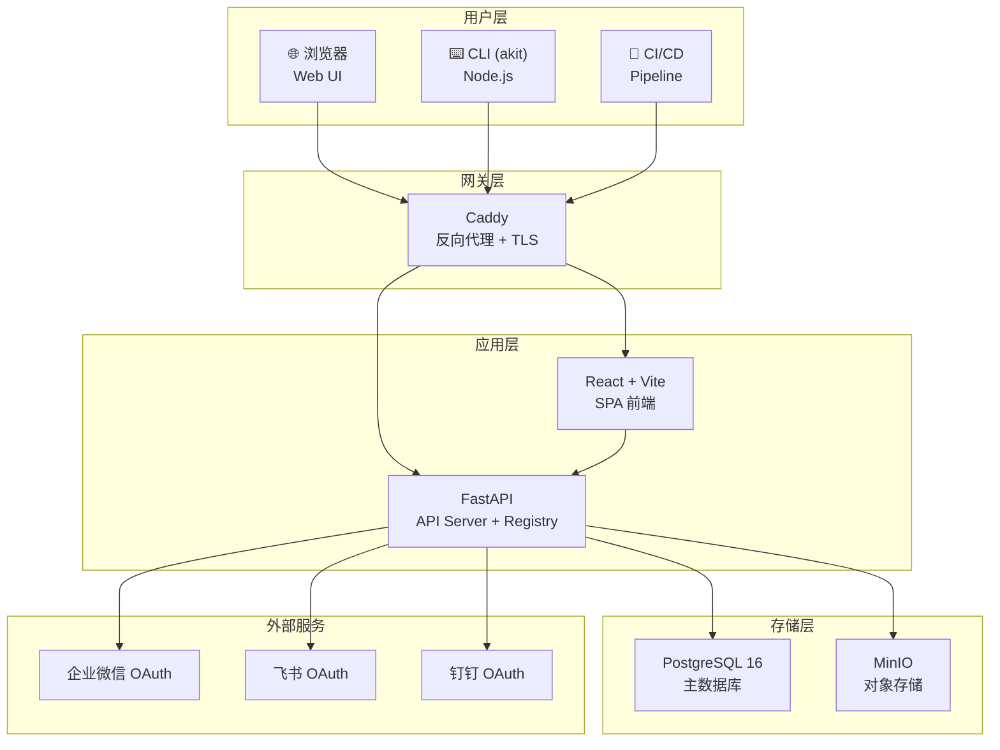
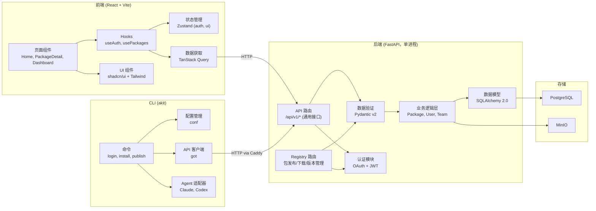
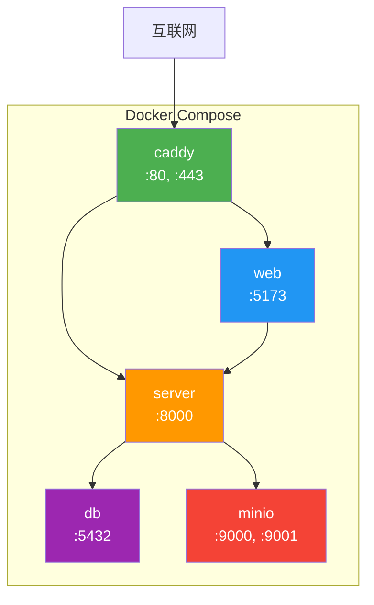
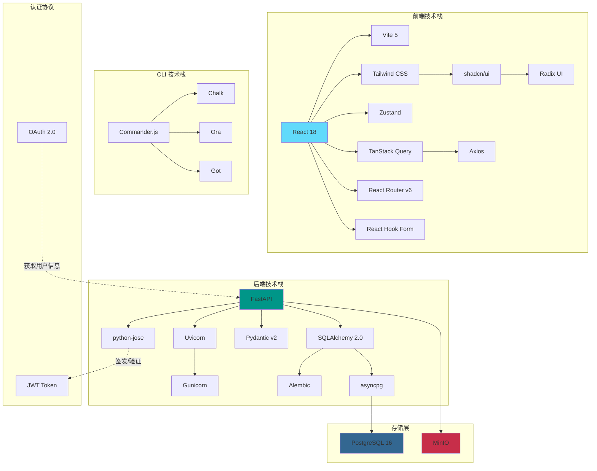

# Agent Kit Admin - 完整架构图

## 系统架构总览

```mermaid
graph TB
    subgraph "用户层"
        Browser["🌐 浏览器<br/>Web UI"]
        CLI["⌨️ CLI (akit)<br/>Node.js"]
        CI["🤖 CI/CD<br/>Pipeline"]
    end

    subgraph "网关层"
        Caddy["Caddy<br/>反向代理 + TLS"]
    end

    subgraph "应用层"
        React["React + Vite<br/>SPA 前端"]
        FastAPI["FastAPI<br/>API Server + Registry"]
    end

    subgraph "存储层"
        PostgreSQL["PostgreSQL 16<br/>主数据库"]
        MinIO["MinIO<br/>对象存储"]
    end

    subgraph "外部服务"
        WeChatWork["企业微信 OAuth"]
        Feishu["飞书 OAuth"]
        DingTalk["钉钉 OAuth"]
    end

    Browser --> Caddy
    CLI --> Caddy
    CI --> Caddy

    Caddy --> React
    Caddy --> FastAPI

    React --> FastAPI
    FastAPI --> PostgreSQL
    FastAPI --> MinIO

    FastAPI --> WeChatWork
    FastAPI --> Feishu
    FastAPI --> DingTalk
```

> **说明：** API Server 和 Registry 是同一个 FastAPI 应用内的逻辑分层（见 [02-architecture.md](../02-architecture.md)），不是独立服务。

## 组件详细架构

```mermaid
graph LR
    subgraph "前端 (React + Vite)"
        direction TB
        Pages["页面组件<br/>Home, PackageDetail, Dashboard"]
        Hooks["Hooks<br/>useAuth, usePackages"]
        Stores["状态管理<br/>Zustand (auth, ui)"]
        Query["数据获取<br/>TanStack Query"]
        UI["UI 组件<br/>shadcn/ui + Tailwind"]
    end

    subgraph "后端 (FastAPI，单进程)"
        direction TB
        API["API 路由<br/>/api/v1/* (通用接口)"]
        Registry["Registry 路由<br/>包发布/下载/版本管理"]
        Services["业务逻辑层<br/>Package, User, Team"]
        Models["数据模型<br/>SQLAlchemy 2.0"]
        Schemas["数据验证<br/>Pydantic v2"]
        AuthModule["认证模块<br/>OAuth + JWT"]
    end

    subgraph "CLI (akit)"
        direction TB
        Commands["命令<br/>login, install, publish"]
        Config["配置管理<br/>conf"]
        API_Client["API 客户端<br/>got"]
        Agent["Agent 适配器<br/>Claude, Codex"]
    end

    subgraph "存储"
        PostgreSQL["PostgreSQL"]
        MinIO["MinIO"]
    end

    Pages --> Hooks
    Hooks --> Query
    Hooks --> Stores
    Pages --> UI
    Query -->|HTTP| API

    API --> Schemas
    Registry --> Schemas
    Schemas --> Services
    Services --> Models
    API --> AuthModule
    Registry --> AuthModule

    Models --> PostgreSQL
    Services --> MinIO

    Commands --> API_Client
    Commands --> Config
    Commands --> Agent
    API_Client -->|HTTP via Caddy| API
```

## 部署架构

```mermaid
graph TB
    subgraph "Docker Compose"
        direction TB
        Caddy_Container["caddy<br/>:80, :443"]
        Web_Container["web<br/>:5173"]
        Server_Container["server<br/>:8000"]
        DB_Container["db<br/>:5432"]
        MinIO_Container["minio<br/>:9000, :9001"]
    end

    Internet["互联网"] --> Caddy_Container

    Caddy_Container --> Web_Container
    Caddy_Container --> Server_Container

    Web_Container --> Server_Container
    Server_Container --> DB_Container
    Server_Container --> MinIO_Container

    style Caddy_Container fill:#4CAF50,color:#fff
    style Web_Container fill:#2196F3,color:#fff
    style Server_Container fill:#FF9800,color:#fff
    style DB_Container fill:#9C27B0,color:#fff
    style MinIO_Container fill:#F44336,color:#fff
```

## 技术栈分层

```mermaid
graph TB
    subgraph "前端技术栈"
        React["React 18"]
        Vite["Vite 5"]
        Tailwind["Tailwind CSS"]
        ShadcnUI["shadcn/ui"]
        RadixUI["Radix UI"]
        Zustand["Zustand"]
        TanStackQuery["TanStack Query"]
        ReactRouter["React Router v6"]
        ReactHookForm["React Hook Form"]
        Axios["Axios"]
    end

    subgraph "后端技术栈"
        FastAPI_["FastAPI"]
        Uvicorn["Uvicorn"]
        Gunicorn["Gunicorn"]
        SQLAlchemy["SQLAlchemy 2.0"]
        Alembic["Alembic"]
        AsyncPG["asyncpg"]
        Pydantic["Pydantic v2"]
        PythonJOSE["python-jose"]
    end

    subgraph "CLI 技术栈"
        Commander["Commander.js"]
        Chalk["Chalk"]
        Ora["Ora"]
        Got["Got"]
    end

    subgraph "存储层"
        PostgreSQL_["PostgreSQL 16"]
        MinIO_["MinIO"]
    end

    subgraph "认证协议"
        OAuth["OAuth 2.0"]
        JWT["JWT Token"]
    end

    %% 前端依赖
    React --> Vite
    React --> Tailwind
    Tailwind --> ShadcnUI
    ShadcnUI --> RadixUI
    React --> Zustand
    React --> TanStackQuery
    React --> ReactRouter
    React --> ReactHookForm
    TanStackQuery --> Axios

    %% 后端依赖
    FastAPI_ --> Uvicorn
    Uvicorn --> Gunicorn
    FastAPI_ --> SQLAlchemy
    FastAPI_ --> Pydantic
    FastAPI_ --> PythonJOSE
    SQLAlchemy --> Alembic
    SQLAlchemy --> AsyncPG
    AsyncPG --> PostgreSQL_

    %% CLI 依赖
    Commander --> Chalk
    Commander --> Ora
    Commander --> Got

    %% 认证关系
    PythonJOSE -.->|签发/验证| JWT
    OAuth -.->|获取用户信息| FastAPI_

    %% 存储关系
    FastAPI_ --> MinIO_

    style React fill:#61DAFB
    style FastAPI_ fill:#009688
    style PostgreSQL_ fill:#336791
    style MinIO_ fill:#C72E49
```
