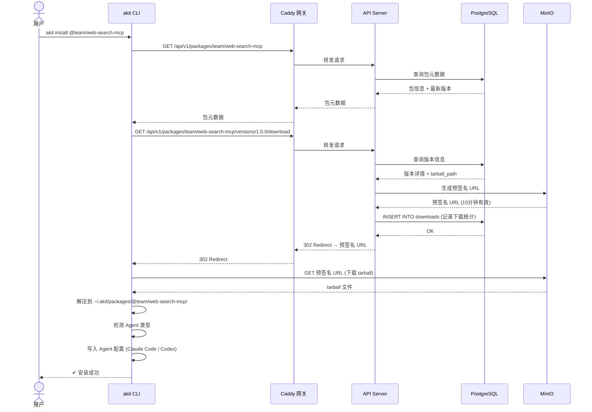
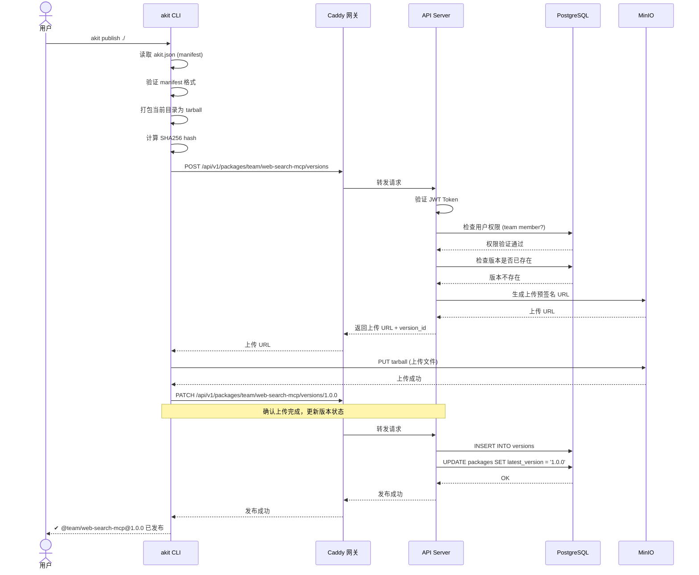
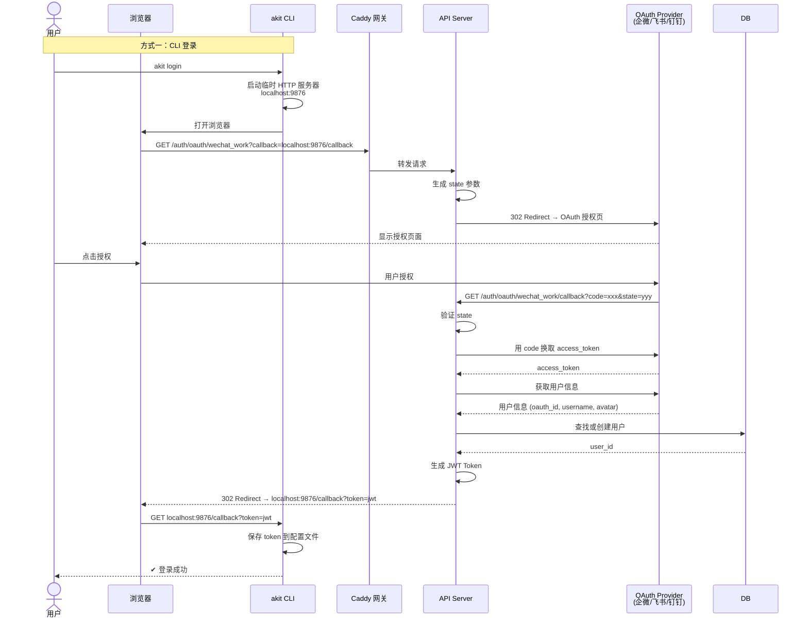
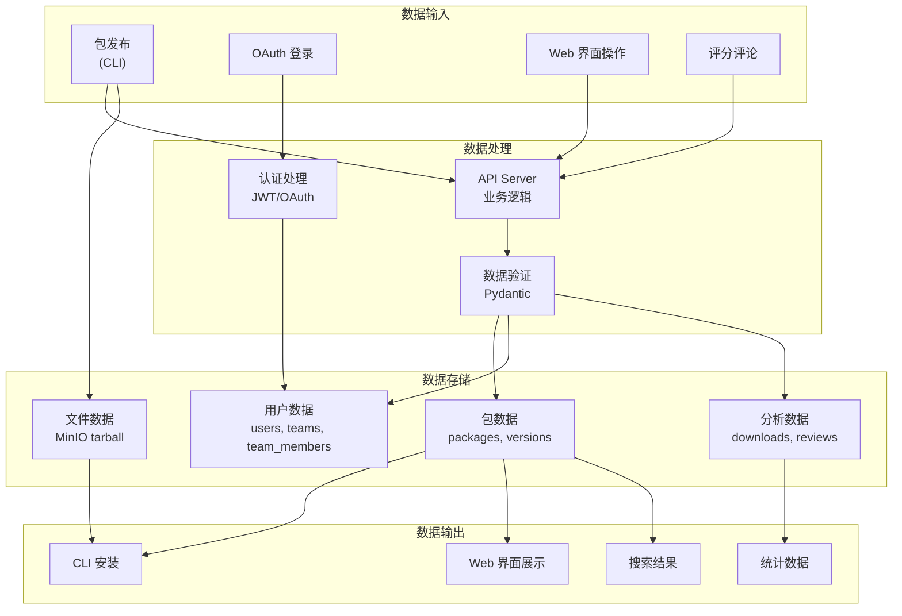
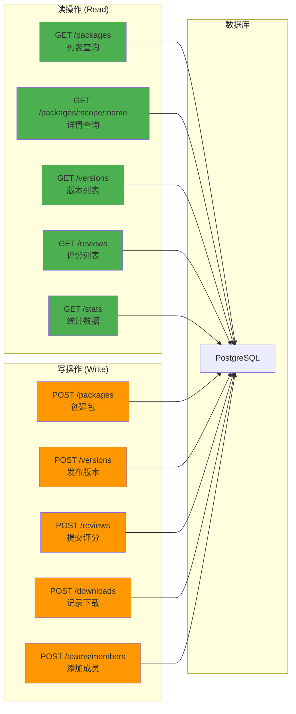

# Agent Kit Admin - 数据流图

## 包安装流程 (Package Install)

```mermaid
sequenceDiagram
    actor User as 用户
    participant CLI as akit CLI
    participant Caddy as Caddy 网关
    participant API as API Server
    participant DB as PostgreSQL
    participant MinIO as MinIO

    User->>CLI: akit install @team/web-search-mcp

    CLI->>Caddy: GET /api/v1/packages/team/web-search-mcp
    Caddy->>API: 转发请求

    API->>DB: 查询包元数据
    DB-->>API: 包信息 + 最新版本

    API-->>Caddy: 包元数据
    Caddy-->>CLI: 包元数据

    CLI->>Caddy: GET /api/v1/packages/team/web-search-mcp/versions/1.0.0/download
    Caddy->>API: 转发请求

    API->>DB: 查询版本信息
    DB-->>API: 版本详情 + tarball_path

    API->>MinIO: 生成预签名 URL
    MinIO-->>API: 预签名 URL (15分钟有效)

    API->>DB: INSERT INTO downloads (记录下载统计)
    DB-->>API: OK

    API-->>Caddy: 302 Redirect → 预签名 URL
    Caddy-->>CLI: 302 Redirect

    CLI->>MinIO: GET 预签名 URL (下载 tarball)
    MinIO-->>CLI: tarball 文件

    CLI->>CLI: 解压到 ~/.akit/packages/@team/web-search-mcp/
    CLI->>CLI: 检测 Agent 类型
    CLI->>CLI: 写入 Agent 配置 (Claude Code / Codex)

    CLI-->>User: ✔ 安装成功
```

## 包发布流程 (Package Publish)

```mermaid
sequenceDiagram
    actor User as 用户
    participant CLI as akit CLI
    participant Caddy as Caddy 网关
    participant API as API Server
    participant DB as PostgreSQL
    participant MinIO as MinIO

    User->>CLI: akit publish ./

    CLI->>CLI: 读取 akit.json (manifest)
    CLI->>CLI: 验证 manifest 格式
    CLI->>CLI: 打包当前目录为 tarball

    CLI->>CLI: 计算 SHA256 hash

    CLI->>Caddy: POST /api/v1/packages/team/web-search-mcp/versions
    Caddy->>API: 转发请求

    API->>API: 验证 JWT Token
    API->>DB: 检查用户权限 (team member?)
    DB-->>API: 权限验证通过

    API->>DB: 检查版本是否已存在
    DB-->>API: 版本不存在

    API->>MinIO: 生成上传预签名 URL
    MinIO-->>API: 上传 URL

    API-->>Caddy: 返回上传 URL + version_id
    Caddy-->>CLI: 上传 URL

    CLI->>MinIO: PUT tarball (上传文件)
    MinIO-->>CLI: 上传成功

    CLI->>Caddy: PATCH /api/v1/packages/team/web-search-mcp/versions/1.0.0
    Note over CLI,API: 确认上传完成，更新版本状态

    Caddy->>API: 转发请求

    API->>DB: INSERT INTO versions
    API->>DB: UPDATE packages SET latest_version = '1.0.0'
    DB-->>API: OK

    API-->>Caddy: 发布成功
    Caddy-->>CLI: 发布成功
    CLI-->>User: ✔ @team/web-search-mcp@1.0.0 已发布
```

## OAuth 认证流程

```mermaid
sequenceDiagram
    actor User as 用户
    participant Browser as 浏览器
    participant CLI as akit CLI
    participant Caddy as Caddy 网关
    participant API as API Server
    participant OAuth as OAuth Provider<br/>(企微/飞书/钉钉)

    Note over User,CLI: 方式一：CLI 登录
    User->>CLI: akit login

    CLI->>CLI: 启动临时 HTTP 服务器<br/>localhost:9876

    CLI->>Browser: 打开浏览器
    Browser->>Caddy: GET /auth/oauth/wechat_work?callback=localhost:9876/callback

    Caddy->>API: 转发请求
    API->>API: 生成 state 参数
    API->>OAuth: 302 Redirect → OAuth 授权页

    OAuth-->>Browser: 显示授权页面
    User->>Browser: 点击授权

    Browser->>OAuth: 用户授权
    OAuth->>API: GET /auth/oauth/wechat_work/callback?code=xxx&state=yyy

    API->>API: 验证 state
    API->>OAuth: 用 code 换取 access_token
    OAuth-->>API: access_token

    API->>OAuth: 获取用户信息
    OAuth-->>API: 用户信息 (oauth_id, username, avatar)

    API->>DB: 查找或创建用户
    DB-->>API: user_id

    API->>API: 生成 JWT Token

    API-->>Browser: 302 Redirect → localhost:9876/callback?token=jwt
    Browser->>CLI: GET localhost:9876/callback?token=jwt

    CLI->>CLI: 保存 token 到配置文件
    CLI-->>User: ✔ 登录成功
```

## 数据流向图

```mermaid
flowchart TB
    subgraph "数据输入"
        Publish["包发布<br/>(CLI)"]
        OAuth_Login["OAuth 登录"]
        Web_Input["Web 界面操作"]
        Review["评分评论"]
    end

    subgraph "数据处理"
        API_Process["API Server<br/>业务逻辑"]
        Auth_Process["认证处理<br/>JWT/OAuth"]
        Validation["数据验证<br/>Pydantic"]
    end

    subgraph "数据存储"
        User_Data["用户数据<br/>users, teams, team_members"]
        Package_Data["包数据<br/>packages, versions"]
        File_Data["文件数据<br/>MinIO tarball"]
        Analytics_Data["分析数据<br/>downloads, reviews"]
    end

    subgraph "数据输出"
        CLI_Install["CLI 安装"]
        Web_View["Web 界面展示"]
        Stats["统计数据"]
        Search["搜索结果"]
    end

    Publish --> API_Process
    OAuth_Login --> Auth_Process
    Web_Input --> API_Process
    Review --> API_Process

    Auth_Process --> User_Data
    API_Process --> Validation

    Validation --> Package_Data
    Validation --> User_Data
    Validation --> Analytics_Data

    Publish --> File_Data

    Package_Data --> CLI_Install
    File_Data --> CLI_Install
    Package_Data --> Web_View
    Analytics_Data --> Stats
    Package_Data --> Search
```

## 数据库读写流

```mermaid
flowchart LR
    subgraph "读操作 (Read)"
        R1["GET /packages<br/>列表查询"]
        R2["GET /packages/:scope/:name<br/>详情查询"]
        R3["GET /versions<br/>版本列表"]
        R4["GET /reviews<br/>评分列表"]
        R5["GET /stats<br/>统计数据"]
    end

    subgraph "写操作 (Write)"
        W1["POST /packages<br/>创建包"]
        W2["POST /versions<br/>发布版本"]
        W3["POST /reviews<br/>提交评分"]
        W4["POST /downloads<br/>记录下载"]
        W5["POST /teams/members<br/>添加成员"]
    end

    subgraph "数据库"
        DB["PostgreSQL"]
    end

    R1 --> DB
    R2 --> DB
    R3 --> DB
    R4 --> DB
    R5 --> DB

    W1 --> DB
    W2 --> DB
    W3 --> DB
    W4 --> DB
    W5 --> DB

    style R1 fill:#4CAF50
    style R2 fill:#4CAF50
    style R3 fill:#4CAF50
    style R4 fill:#4CAF50
    style R5 fill:#4CAF50
    style W1 fill:#FF9800
    style W2 fill:#FF9800
    style W3 fill:#FF9800
    style W4 fill:#FF9800
    style W5 fill:#FF9800
```
