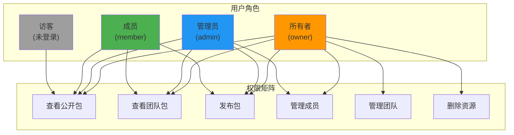
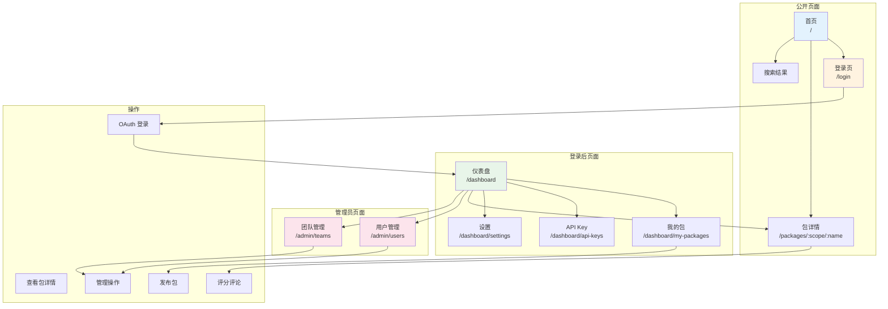
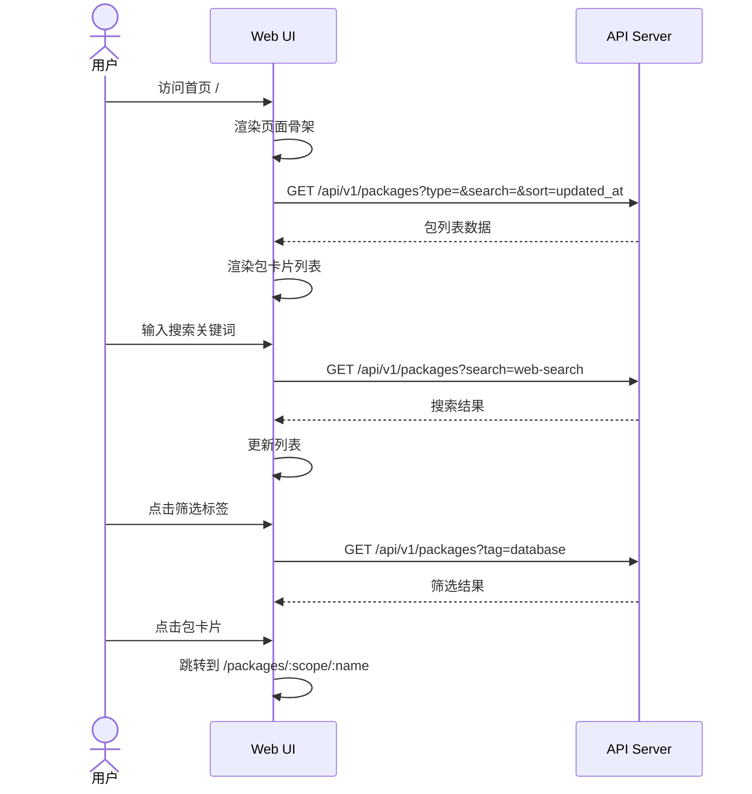
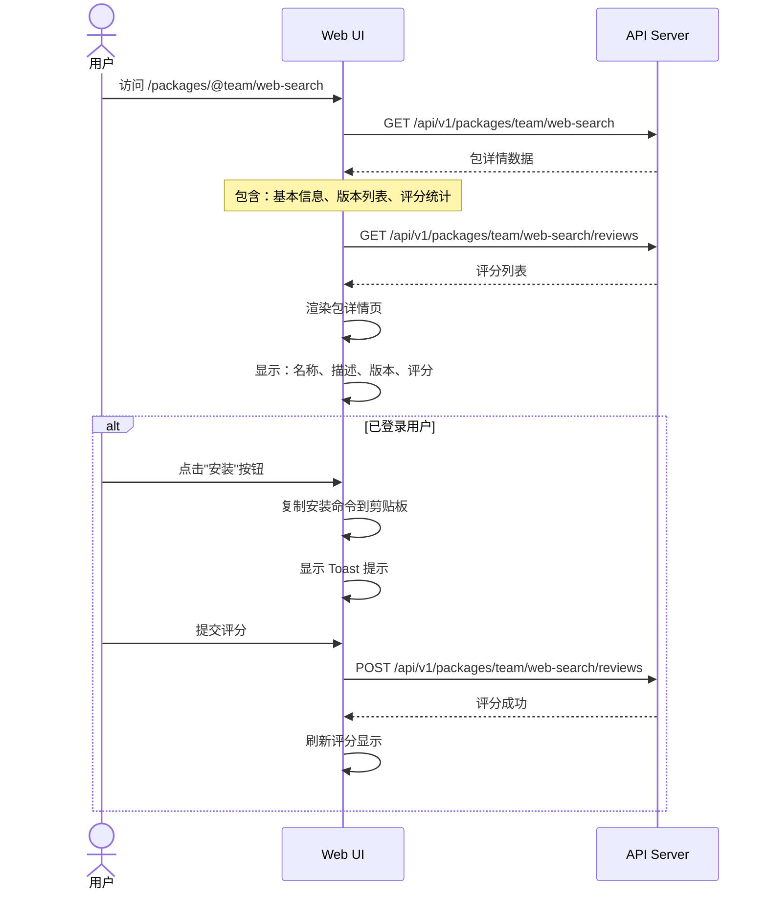
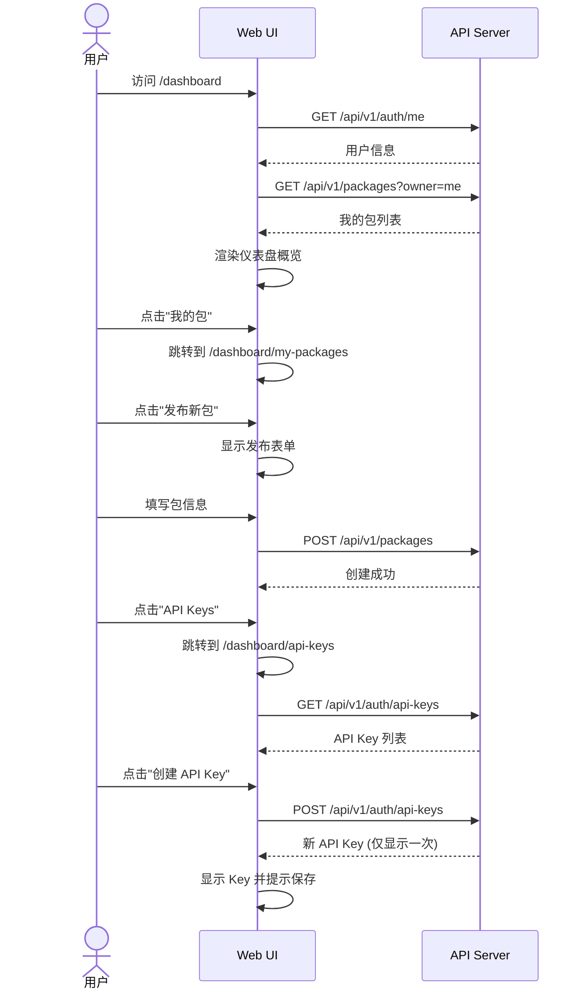
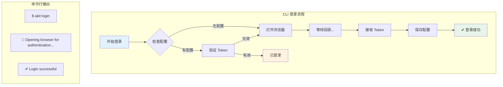
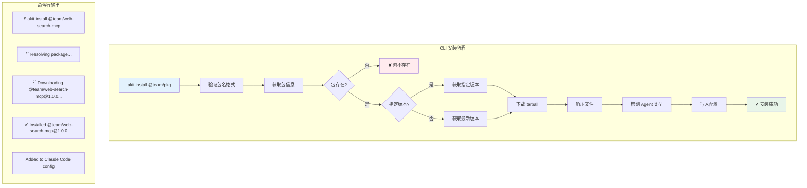
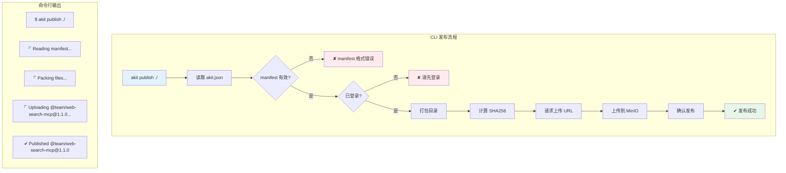
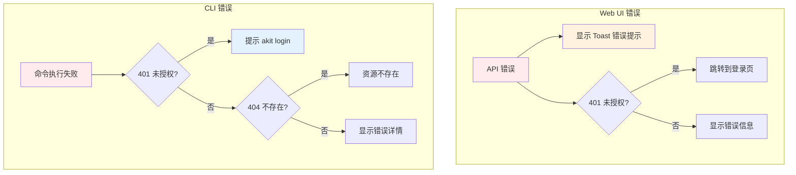
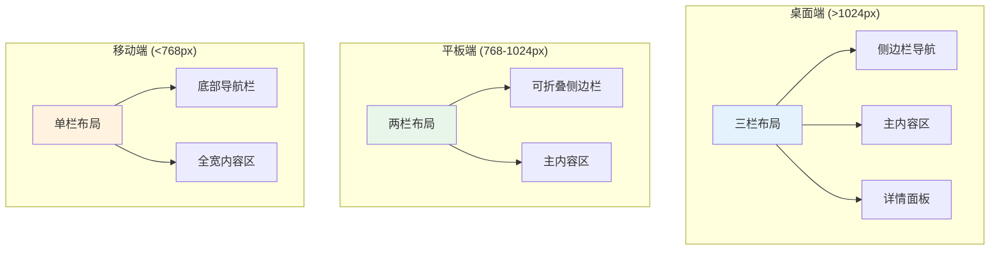

# Agent Kit Admin - 用户交互图

## 用户角色与权限

```mermaid
graph TB
    subgraph "用户角色"
        Visitor["访客<br/>(未登录)"]
        Member["成员<br/>(member)"]
        Admin["管理员<br/>(admin)"]
        Owner["所有者<br/>(owner)"]
    end

    subgraph "权限矩阵"
        ViewPublic["查看公开包"]
        ViewTeam["查看团队包"]
        Publish["发布包"]
        ManageMembers["管理成员"]
        ManageTeam["管理团队"]
        Delete["删除资源"]
    end

    Visitor --> ViewPublic
    Member --> ViewPublic
    Member --> ViewTeam
    Member --> Publish
    Admin --> ViewPublic
    Admin --> ViewTeam
    Admin --> Publish
    Admin --> ManageMembers
    Owner --> ViewPublic
    Owner --> ViewTeam
    Owner --> Publish
    Owner --> ManageMembers
    Owner --> ManageTeam
    Owner --> Delete

    style Visitor fill:#9E9E9E
    style Member fill:#4CAF50
    style Admin fill:#2196F3
    style Owner fill:#FF9800
```

## Web UI 页面流程

```mermaid
flowchart TB
    subgraph "公开页面"
        Home["首页<br/>/"]
        Login["登录页<br/>/login"]
        PackageDetail["包详情<br/>/packages/:scope/:name"]
        Search["搜索结果"]
    end

    subgraph "登录后页面"
        Dashboard["仪表盘<br/>/dashboard"]
        MyPackages["我的包<br/>/dashboard/my-packages"]
        ApiKeys["API Key<br/>/dashboard/api-keys"]
        Settings["设置<br/>/dashboard/settings"]
    end

    subgraph "管理员页面"
        Users["用户管理<br/>/admin/users"]
        Teams["团队管理<br/>/admin/teams"]
    end

    subgraph "操作"
        OAuth["OAuth 登录"]
        ViewPackage["查看包详情"]
        Publish_P["发布包"]
        Rate["评分评论"]
        Manage["管理操作"]
    end

    Home --> Login
    Home --> PackageDetail
    Home --> Search
    Login --> OAuth
    OAuth --> Dashboard

    Dashboard --> MyPackages
    Dashboard --> ApiKeys
    Dashboard --> Settings
    Dashboard --> PackageDetail

    MyPackages --> Publish_P
    PackageDetail --> Rate

    Dashboard --> Users
    Dashboard --> Teams
    Users --> Manage
    Teams --> Manage

    style Home fill:#E3F2FD
    style Login fill:#FFF3E0
    style Dashboard fill:#E8F5E9
    style Users fill:#FCE4EC
    style Teams fill:#FCE4EC
```

## Web UI 交互流程

### 首页浏览

```mermaid
sequenceDiagram
    actor User as 用户
    participant Web as Web UI
    participant API as API Server

    User->>Web: 访问首页 /
    Web->>Web: 渲染页面骨架

    Web->>API: GET /api/v1/packages?type=&search=&sort=updated_at
    API-->>Web: 包列表数据

    Web->>Web: 渲染包卡片列表

    User->>Web: 输入搜索关键词
    Web->>API: GET /api/v1/packages?search=web-search
    API-->>Web: 搜索结果

    Web->>Web: 更新列表

    User->>Web: 点击筛选标签
    Web->>API: GET /api/v1/packages?tag=database
    API-->>Web: 筛选结果

    User->>Web: 点击包卡片
    Web->>Web: 跳转到 /packages/:scope/:name
```

### 包详情页

```mermaid
sequenceDiagram
    actor User as 用户
    participant Web as Web UI
    participant API as API Server

    User->>Web: 访问 /packages/@team/web-search
    Web->>API: GET /api/v1/packages/team/web-search

    API-->>Web: 包详情数据
    Note over Web: 包含：基本信息、版本列表、评分统计

    Web->>API: GET /api/v1/packages/team/web-search/reviews
    API-->>Web: 评分列表

    Web->>Web: 渲染包详情页
    Web->>Web: 显示：名称、描述、版本、评分

    alt 已登录用户
        User->>Web: 点击"安装"按钮
        Web->>Web: 复制安装命令到剪贴板
        Web->>Web: 显示 Toast 提示

        User->>Web: 提交评分
        Web->>API: POST /api/v1/packages/team/web-search/reviews
        API-->>Web: 评分成功
        Web->>Web: 刷新评分显示
    end
```

### 仪表盘操作

```mermaid
sequenceDiagram
    actor User as 用户
    participant Web as Web UI
    participant API as API Server

    User->>Web: 访问 /dashboard
    Web->>API: GET /api/v1/auth/me
    API-->>Web: 用户信息

    Web->>API: GET /api/v1/packages?owner=me
    API-->>Web: 我的包列表

    Web->>Web: 渲染仪表盘概览

    User->>Web: 点击"我的包"
    Web->>Web: 跳转到 /dashboard/my-packages

    User->>Web: 点击"发布新包"
    Web->>Web: 显示发布表单

    User->>Web: 填写包信息
    Web->>API: POST /api/v1/packages
    API-->>Web: 创建成功

    User->>Web: 点击"API Keys"
    Web->>Web: 跳转到 /dashboard/api-keys

    Web->>API: GET /api/v1/auth/api-keys
    API-->>Web: API Key 列表

    User->>Web: 点击"创建 API Key"
    Web->>API: POST /api/v1/auth/api-keys
    API-->>Web: 新 API Key (仅显示一次)
    Web->>Web: 显示 Key 并提示保存
```

## CLI 交互流程

### 登录交互

```mermaid
flowchart TB
    subgraph "CLI 登录流程"
        Start["开始登录"] --> Check{"检查配置"}
        Check -->|无配置| Browser["打开浏览器"]
        Check -->|有配置| Verify["验证 Token"]
        Verify -->|有效| Already["已登录"]
        Verify -->|无效| Browser

        Browser --> Wait["等待回调..."]
        Wait --> Receive["接收 Token"]
        Receive --> Save["保存配置"]
        Save --> Success["✔ 登录成功"]
    end

    subgraph "命令行输出"
        Output1["$ akit login"]
        Output2["🔗 Opening browser for authentication..."]
        Output3["✔ Login successful"]
    end

    style Start fill:#E3F2FD
    style Success fill:#E8F5E9
    style Already fill:#FFF3E0
```

### 安装交互

```mermaid
flowchart TB
    subgraph "CLI 安装流程"
        Start["akit install @team/pkg"] --> Validate["验证包名格式"]
        Validate --> Fetch["获取包信息"]
        Fetch --> NotFound{"包存在?"}
        NotFound -->|否| Error1["✘ 包不存在"]
        NotFound -->|是| Version{"指定版本?"}

        Version -->|是| Specific["获取指定版本"]
        Version -->|否| Latest["获取最新版本"]

        Specific --> Download["下载 tarball"]
        Latest --> Download

        Download --> Extract["解压文件"]
        Extract --> Detect["检测 Agent 类型"]
        Detect --> Config["写入配置"]
        Config --> Done["✔ 安装成功"]
    end

    subgraph "命令行输出"
        Output1["$ akit install @team/web-search-mcp"]
        Output2["⠋ Resolving package..."]
        Output3["⠋ Downloading @team/web-search-mcp@1.0.0..."]
        Output4["✔ Installed @team/web-search-mcp@1.0.0"]
        Output5["  Added to Claude Code config"]
    end

    style Start fill:#E3F2FD
    style Done fill:#E8F5E9
    style Error1 fill:#FFEBEE
```

### 发布交互

```mermaid
flowchart TB
    subgraph "CLI 发布流程"
        Start["akit publish ./"] --> ReadManifest["读取 akit.json"]
        ReadManifest --> ValidateManifest{"manifest 有效?"}
        ValidateManifest -->|否| Error1["✘ manifest 格式错误"]

        ValidateManifest -->|是| CheckAuth{"已登录?"}
        CheckAuth -->|否| Error2["✘ 请先登录"]

        CheckAuth -->|是| Pack["打包目录"]
        Pack --> CalcHash["计算 SHA256"]
        CalcHash --> RequestUpload["请求上传 URL"]
        RequestUpload --> Upload["上传到 MinIO"]
        Upload --> Confirm["确认发布"]
        Confirm --> Done["✔ 发布成功"]
    end

    subgraph "命令行输出"
        Output1["$ akit publish ./"]
        Output2["⠋ Reading manifest..."]
        Output3["⠋ Packing files..."]
        Output4["⠋ Uploading @team/web-search-mcp@1.1.0..."]
        Output5["✔ Published @team/web-search-mcp@1.1.0"]
    end

    style Start fill:#E3F2FD
    style Done fill:#E8F5E9
    style Error1 fill:#FFEBEE
    style Error2 fill:#FFEBEE
```

## 错误处理交互

```mermaid
flowchart TB
    subgraph "Web UI 错误"
        WebError["API 错误"]
        WebError --> Toast["显示 Toast 错误提示"]
        WebError --> 401_Web{"401 未授权?"}
        401_Web -->|是| RedirectToLogin["跳转到登录页"]
        401_Web -->|否| ShowError["显示错误信息"]
    end

    subgraph "CLI 错误"
        CLIError["命令执行失败"]
        CLIError --> 401_CLI{"401 未授权?"}
        401_CLI -->|是| LoginPrompt["提示 akit login"]
        401_CLI -->|否| 404_CLI{"404 不存在?"}
        404_CLI -->|是| NotFoundMsg["资源不存在"]
        404_CLI -->|否| GeneralError["显示错误详情"]
    end

    style WebError fill:#FFEBEE
    style CLIError fill:#FFEBEE
    style Toast fill:#FFF3E0
    style LoginPrompt fill:#E3F2FD
```

## 响应式布局

```mermaid
graph TB
    subgraph "桌面端 (>1024px)"
        Desktop["三栏布局"]
        Desktop --> Sidebar["侧边栏导航"]
        Desktop --> Main["主内容区"]
        Desktop --> Detail["详情面板"]
    end

    subgraph "平板端 (768-1024px)"
        Tablet["两栏布局"]
        Tablet --> CollapsedSidebar["可折叠侧边栏"]
        Tablet --> TabletMain["主内容区"]
    end

    subgraph "移动端 (<768px)"
        Mobile["单栏布局"]
        Mobile --> BottomNav["底部导航栏"]
        Mobile --> MobileMain["全宽内容区"]
    end

    style Desktop fill:#E3F2FD
    style Tablet fill:#E8F5E9
    style Mobile fill:#FFF3E0
```
