# Agent Kit Admin - E-R 图

## 完整实体关系图

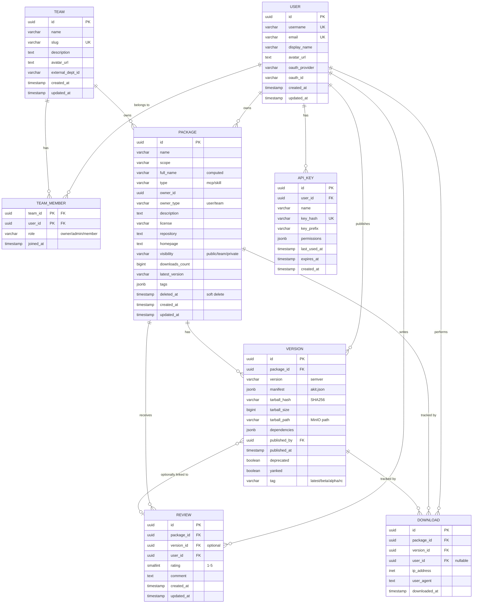
```mermaid
erDiagram
    USER ||--o{ TEAM_MEMBER : "belongs to"
    USER ||--o{ PACKAGE : "owns"
    USER ||--o{ VERSION : "publishes"
    USER ||--o{ REVIEW : "writes"
    USER ||--o{ DOWNLOAD : "performs"
    USER ||--o{ API_KEY : "has"

    TEAM ||--o{ TEAM_MEMBER : "has"
    TEAM ||--o{ PACKAGE : "owns"

    PACKAGE ||--o{ VERSION : "has"
    PACKAGE ||--o{ REVIEW : "receives"
    PACKAGE ||--o{ DOWNLOAD : "tracked by"

    VERSION ||--o{ DOWNLOAD : "tracked by"
    VERSION }o--o| REVIEW : "optionally linked to"

    USER {
        uuid id PK
        varchar username UK
        varchar email UK
        varchar display_name
        text avatar_url
        varchar oauth_provider
        varchar oauth_id
        timestamp created_at
        timestamp updated_at
    }

    TEAM {
        uuid id PK
        varchar name
        varchar slug UK
        text description
        text avatar_url
        varchar external_dept_id
        timestamp created_at
        timestamp updated_at
    }

    TEAM_MEMBER {
        uuid team_id PK "FK"
        uuid user_id PK "FK"
        varchar role "owner/admin/member"
        timestamp joined_at
    }

    PACKAGE {
        uuid id PK
        varchar name
        varchar scope
        varchar full_name "computed"
        varchar type "mcp/skill"
        uuid owner_id
        varchar owner_type "user/team"
        text description
        varchar license
        text repository
        text homepage
        varchar visibility "public/team/private"
        bigint downloads_count
        varchar latest_version
        jsonb tags
        timestamp deleted_at "soft delete"
        timestamp created_at
        timestamp updated_at
    }

    VERSION {
        uuid id PK
        uuid package_id FK
        varchar version "semver"
        jsonb manifest "akit.json"
        varchar tarball_hash "SHA256"
        bigint tarball_size
        varchar tarball_path "MinIO path"
        jsonb dependencies
        uuid published_by FK
        timestamp published_at
        boolean deprecated
        boolean yanked
        varchar tag "latest/beta/alpha/rc"
    }

    REVIEW {
        uuid id PK
        uuid package_id FK
        uuid version_id FK "optional"
        uuid user_id FK
        smallint rating "1-5"
        text comment
        timestamp created_at
        timestamp updated_at
    }

    DOWNLOAD {
        uuid id PK
        uuid package_id FK
        uuid version_id FK
        uuid user_id FK "nullable"
        inet ip_address
        text user_agent
        timestamp downloaded_at
    }

    API_KEY {
        uuid id PK
        uuid user_id FK
        varchar name
        varchar key_hash UK
        varchar key_prefix
        jsonb permissions
        timestamp last_used_at
        timestamp expires_at
        timestamp created_at
    }
```

## 用户与团队关系

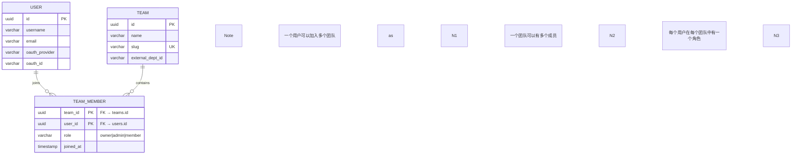
```mermaid
erDiagram
    USER ||--o{ TEAM_MEMBER : "joins"
    TEAM ||--o{ TEAM_MEMBER : "contains"

    USER {
        uuid id PK
        varchar username
        varchar email
        varchar oauth_provider
        varchar oauth_id
    }

    TEAM {
        uuid id PK
        varchar name
        varchar slug UK
        varchar external_dept_id
    }

    TEAM_MEMBER {
        uuid team_id PK "FK → teams.id"
        uuid user_id PK "FK → users.id"
        varchar role "owner|admin|member"
        timestamp joined_at
    }

    Note "一个用户可以加入多个团队" as N1
    Note "一个团队可以有多个成员" as N2
    Note "每个用户在每个团队中有一个角色" as N3
```

## 包与版本关系

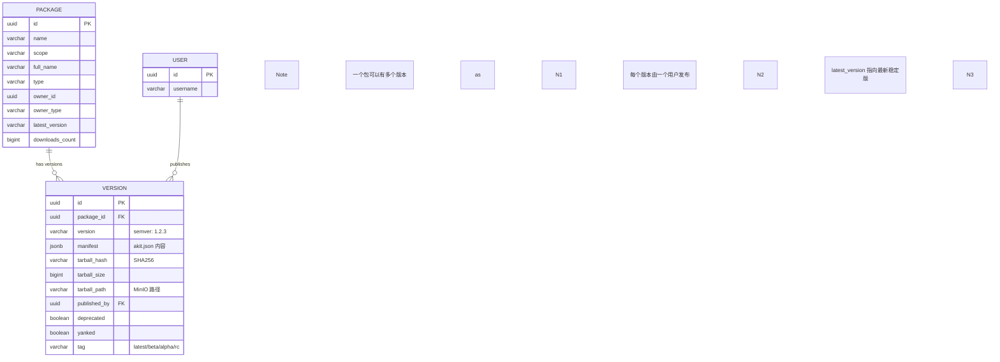
```mermaid
erDiagram
    PACKAGE ||--o{ VERSION : "has versions"
    USER ||--o{ VERSION : "publishes"

    PACKAGE {
        uuid id PK
        varchar name
        varchar scope
        varchar full_name
        varchar type
        uuid owner_id
        varchar owner_type
        varchar latest_version
        bigint downloads_count
    }

    VERSION {
        uuid id PK
        uuid package_id FK
        varchar version "semver: 1.2.3"
        jsonb manifest "akit.json 内容"
        varchar tarball_hash "SHA256"
        bigint tarball_size
        varchar tarball_path "MinIO 路径"
        uuid published_by FK
        boolean deprecated
        boolean yanked
        varchar tag "latest/beta/alpha/rc"
    }

    USER {
        uuid id PK
        varchar username
    }

    Note "一个包可以有多个版本" as N1
    Note "每个版本由一个用户发布" as N2
    Note "latest_version 指向最新稳定版" as N3
```

## 评分系统关系

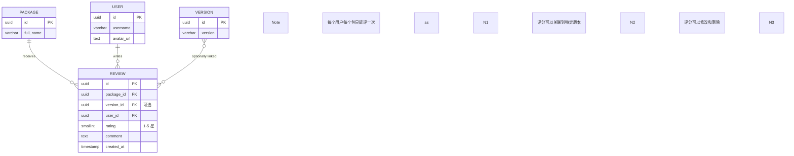
```mermaid
erDiagram
    PACKAGE ||--o{ REVIEW : "receives"
    USER ||--o{ REVIEW : "writes"
    VERSION }o--o{ REVIEW : "optionally linked"

    PACKAGE {
        uuid id PK
        varchar full_name
    }

    REVIEW {
        uuid id PK
        uuid package_id FK
        uuid version_id FK "可选"
        uuid user_id FK
        smallint rating "1-5 星"
        text comment
        timestamp created_at
    }

    VERSION {
        uuid id PK
        varchar version
    }

    USER {
        uuid id PK
        varchar username
        text avatar_url
    }

    Note "每个用户每个包只能评一次" as N1
    Note "评分可以关联到特定版本" as N2
    Note "评分可以修改和删除" as N3
```

## 下载统计关系

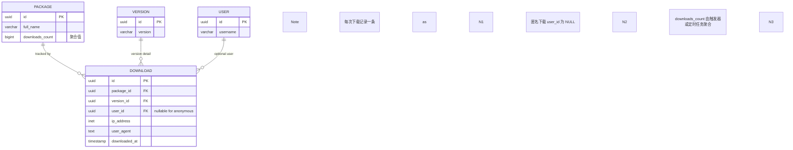
```mermaid
erDiagram
    PACKAGE ||--o{ DOWNLOAD : "tracked by"
    VERSION ||--o{ DOWNLOAD : "version detail"
    USER ||--o{ DOWNLOAD : "optional user"

    PACKAGE {
        uuid id PK
        varchar full_name
        bigint downloads_count "聚合值"
    }

    DOWNLOAD {
        uuid id PK
        uuid package_id FK
        uuid version_id FK
        uuid user_id FK "nullable for anonymous"
        inet ip_address
        text user_agent
        timestamp downloaded_at
    }

    VERSION {
        uuid id PK
        varchar version
    }

    USER {
        uuid id PK
        varchar username
    }

    Note "每次下载记录一条" as N1
    Note "匿名下载 user_id 为 NULL" as N2
    Note "downloads_count 由触发器或定时任务聚合" as N3
```

## API Key 关系

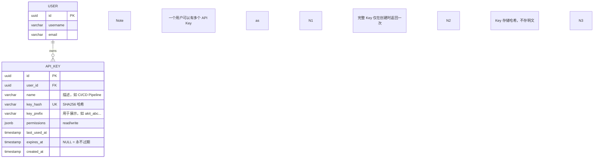
```mermaid
erDiagram
    USER ||--o{ API_KEY : "owns"

    USER {
        uuid id PK
        varchar username
        varchar email
    }

    API_KEY {
        uuid id PK
        uuid user_id FK
        varchar name "描述，如 CI/CD Pipeline"
        varchar key_hash UK "SHA256 哈希"
        varchar key_prefix "用于展示，如 akit_abc..."
        jsonb permissions "read/write"
        timestamp last_used_at
        timestamp expires_at "NULL = 永不过期"
        timestamp created_at
    }

    Note "一个用户可以有多个 API Key" as N1
    Note "完整 Key 仅在创建时返回一次" as N2
    Note "Key 存储哈希，不存明文" as N3
```

## 可见性控制模型

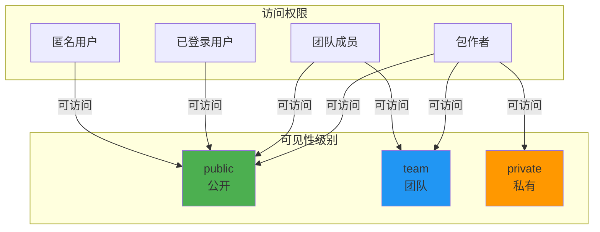
```mermaid
flowchart TB
    subgraph "可见性级别"
        Public["public<br/>公开"]
        Team["team<br/>团队"]
        Private["private<br/>私有"]
    end

    subgraph "访问权限"
        Anonymous["匿名用户"]
        AuthUser["已登录用户"]
        TeamMember["团队成员"]
        Owner["包作者"]
    end

    Anonymous -->|可访问| Public
    AuthUser -->|可访问| Public
    TeamMember -->|可访问| Public
    TeamMember -->|可访问| Team
    Owner -->|可访问| Public
    Owner -->|可访问| Team
    Owner -->|可访问| Private

    style Public fill:#4CAF50
    style Team fill:#2196F3
    style Private fill:#FF9800
```

## Scope 命名空间模型

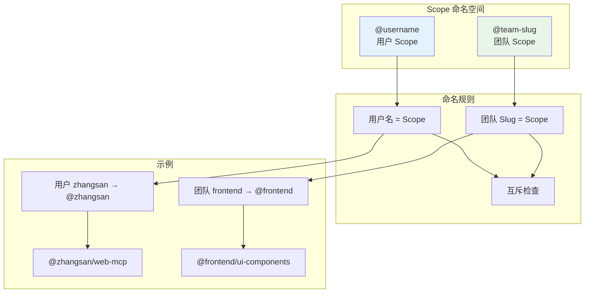
```mermaid
flowchart TB
    subgraph "Scope 命名空间"
        UserScope["@username<br/>用户 Scope"]
        TeamScope["@team-slug<br/>团队 Scope"]
    end

    subgraph "命名规则"
        Rule1["用户名 = Scope"]
        Rule2["团队 Slug = Scope"]
        Rule3["互斥检查"]
    end

    UserScope --> Rule1
    TeamScope --> Rule2
    Rule1 --> Rule3
    Rule2 --> Rule3

    subgraph "示例"
        Example1["用户 zhangsan → @zhangsan"]
        Example2["团队 frontend → @frontend"]
        Example3["@zhangsan/web-mcp"]
        Example4["@frontend/ui-components"]
    end

    Rule1 --> Example1
    Rule2 --> Example2
    Example1 --> Example3
    Example2 --> Example4

    style UserScope fill:#E3F2FD
    style TeamScope fill:#E8F5E9
```

## 软删除模型

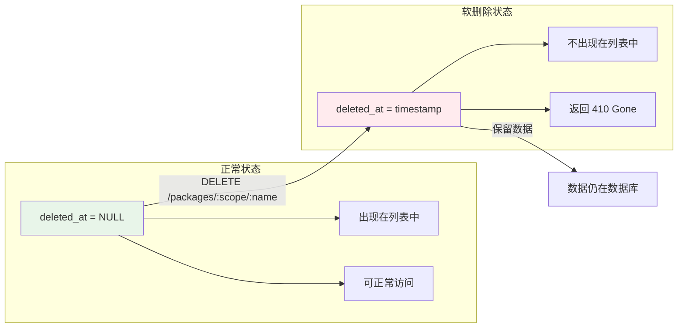
```mermaid
flowchart LR
    subgraph "正常状态"
        Active["deleted_at = NULL"]
        Active --> Visible["出现在列表中"]
        Active --> Access["可正常访问"]
    end

    subgraph "软删除状态"
        Deleted["deleted_at = timestamp"]
        Deleted --> Hidden["不出现在列表中"]
        Deleted --> Gone["返回 410 Gone"]
    end

    Active -->|DELETE /packages/:scope/:name| Deleted
    Deleted -->|保留数据| Data["数据仍在数据库"]

    style Active fill:#E8F5E9
    style Deleted fill:#FFEBEE
```

## 索引策略

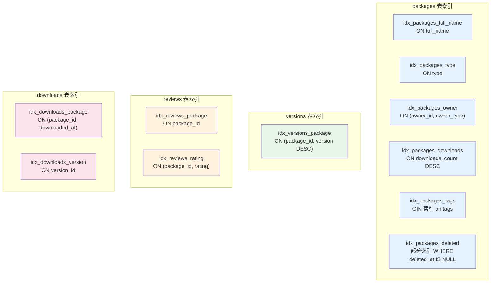
```mermaid
graph TB
    subgraph "packages 表索引"
        P1["idx_packages_full_name<br/>ON full_name"]
        P2["idx_packages_type<br/>ON type"]
        P3["idx_packages_owner<br/>ON (owner_id, owner_type)"]
        P4["idx_packages_downloads<br/>ON downloads_count DESC"]
        P5["idx_packages_tags<br/>GIN 索引 on tags"]
        P6["idx_packages_deleted<br/>部分索引 WHERE deleted_at IS NULL"]
    end

    subgraph "versions 表索引"
        V1["idx_versions_package<br/>ON (package_id, version DESC)"]
    end

    subgraph "reviews 表索引"
        R1["idx_reviews_package<br/>ON package_id"]
        R2["idx_reviews_rating<br/>ON (package_id, rating)"]
    end

    subgraph "downloads 表索引"
        D1["idx_downloads_package<br/>ON (package_id, downloaded_at)"]
        D2["idx_downloads_version<br/>ON version_id"]
    end

    style P1 fill:#E3F2FD
    style P2 fill:#E3F2FD
    style P3 fill:#E3F2FD
    style P4 fill:#E3F2FD
    style P5 fill:#E3F2FD
    style P6 fill:#E3F2FD
    style V1 fill:#E8F5E9
    style R1 fill:#FFF3E0
    style R2 fill:#FFF3E0
    style D1 fill:#FCE4EC
    style D2 fill:#FCE4EC
```

## 分区策略（可选）

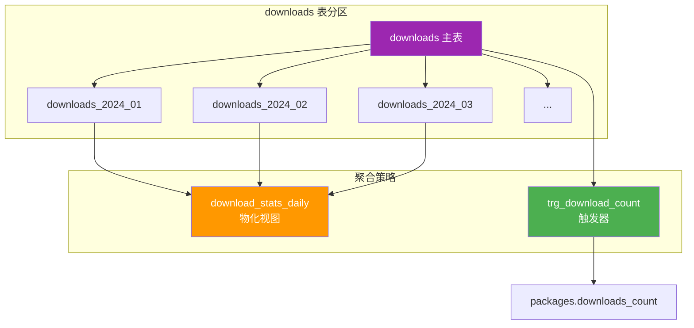
```mermaid
flowchart TB
    subgraph "downloads 表分区"
        Main["downloads 主表"]
        P202401["downloads_2024_01"]
        P202402["downloads_2024_02"]
        P202403["downloads_2024_03"]
        More["..."]
    end

    Main --> P202401
    Main --> P202402
    Main --> P202403
    Main --> More

    subgraph "聚合策略"
        MV["download_stats_daily<br/>物化视图"]
        Trigger["trg_download_count<br/>触发器"]
    end

    P202401 --> MV
    P202402 --> MV
    P202403 --> MV

    Main --> Trigger
    Trigger --> PackageCount["packages.downloads_count"]

    style Main fill:#9C27B0,color:#fff
    style MV fill:#FF9800,color:#fff
    style Trigger fill:#4CAF50,color:#fff
```
